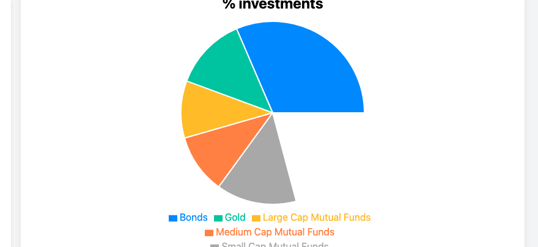
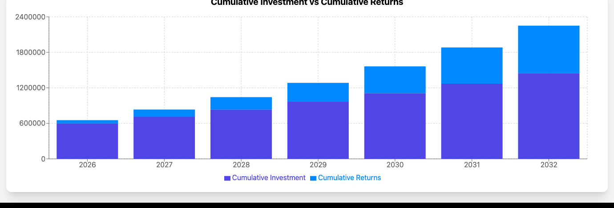

# Risk Based Portfolio Optimiser

A web-based financial planning tool that recommends optimal asset allocation across 5 asset classes — based on the user's investment horizon, annual contribution, and target return — using historically calibrated return rates and 4 pre-defined risk profiles.

---

## Table of Contents
- [What It Does](#what-it-does)
- [Asset Classes & Return Rates](#asset-classes--return-rates)
- [Risk Profiles](#risk-profiles)
- [User Inputs](#user-inputs)
- [Visualisations](#visualisations)
- [Technical Architecture](#technical-architecture)
- [How to Run](#how-to-run)
- [Report](#report)

---

## What It Does

Enter your investment goals. The tool:
1. Projects portfolio growth year-by-year across all 4 risk profiles
2. Identifies which risk profile matches your expected return target
3. Outputs a recommended asset allocation with interactive charts

---

## Asset Classes & Return Rates

Return rates sourced from CRISIL reports, Traders Union gold forecast, and Statista bond/inflation data:

| Asset Class | Annual Return (Assumed) | Risk Level |
|------------|------------------------|-----------|
| Bonds | 6.5% | Very Low |
| Large-cap Mutual Funds | 10.7% | Low–Medium |
| Mid-cap Mutual Funds | 11.25% | Medium |
| Small-cap Mutual Funds | 11.85% | Medium–High |
| Gold | 9.3% | Low–Medium |

---

## Risk Profiles

4 pre-defined portfolios (P1–P4) each with different allocation weights across the 5 asset classes:

| Profile | Bonds | Large-cap | Mid-cap | Small-cap | Gold | Expected Return |
|---------|-------|-----------|---------|-----------|------|----------------|
| P1 — Very Low | High | Low | None | None | Moderate | Conservative |
| P2 — Low–Medium | Moderate | Moderate | Low | None | Moderate | Balanced |
| P3 — Medium–High | Low | Moderate | Moderate | Moderate | Low | Growth |
| P4 — High | None | Low | Moderate | High | Low | Aggressive |

The tool matches the user's expected return target to the closest-fit profile and displays that profile's allocation.

---

## User Inputs

| Input | Description |
|-------|------------|
| Starting Year | Year investment plan begins |
| Final Year | Target end year |
| Initial Investable Amount | Lump-sum available at start |
| Investable Amount Per Annum (IAPA) | Annual contribution |
| IAPA Increment | Annual growth rate of the contribution |
| Expected Return | Target total portfolio value at the final year |

---

## Visualisations

### Asset Allocation — Pie Chart



The pie chart shows the recommended percentage allocation across all 5 asset classes for the matched risk profile.

### Cumulative Investment vs Returns — Stacked Bar Chart



Year-by-year stacked bars: dark bar = total invested capital, light bar = cumulative returns on top. The growing gap between investment and total value shows compound returns accelerating over time.

Three output views for the recommended portfolio:

1. **Pie Chart** — asset allocation breakdown for the matched risk profile
2. **Stacked Bar Graph** — cumulative investment vs. cumulative returns, year by year
3. **Investment Table** — year-by-year: total investment, total returns, total portfolio value

---

## Technical Architecture

| Layer | Technology | Purpose |
|-------|-----------|---------|
| Core Calculations | Python (Pandas, NumPy) | Future value projections, portfolio matching logic |
| Financial Modelling | Python | Compounding returns, allocation simulation |
| Web Interface | HTML + CSS + JavaScript | Interactive input form, real-time output updates |
| Visualisation | JavaScript (Chart.js) | Pie chart and stacked bar graph rendering |

---

## How to Run

```bash
git clone https://github.com/aguru-venkata-saisantosh-patnaik/Portfolio_Optimiser.git
cd Portfolio_Optimiser

# Open in browser
open index.html
# or serve locally
python -m http.server 8000
```

Or use the **live demo** directly (no setup required):
[ravishankar2003.github.io/risk_based_portfolio_optimiser](https://ravishankar2003.github.io/risk_based_portfolio_optimiser/)

---

## Report

The full methodology and design rationale is documented in [`Risk Based Portfolio Optimiser Report.pdf`](Risk%20Based%20Portfolio%20Optimiser%20Report.pdf), covering:
- Project objectives and scope
- Asset return assumptions with source references
- Portfolio construction methodology
- Visualisation design decisions
- Calculation walkthrough with example inputs

---
